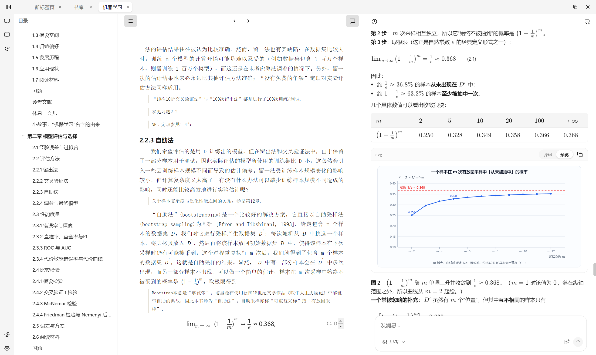

# easy-learn

基于 Electron 的 EPUB 阅读学习应用：把电子书、AI 对话和闪卡复习放在同一个桌面工具里。



## 功能

- **书库**：导入 EPUB 电子书，自动解析元信息与封面
- **阅读器**：基于 foliate-js 的阅读界面，支持目录跳转、公式渲染（KaTeX），支持 EPUB 格式电子书
- **AI 对话**：结合当前书籍内容的阅读助手，支持流式输出与多会话管理
- **闪卡复习**：基于 ts-fsrs 的间隔重复算法，从阅读内容生成与复习卡片
- **内容检索**：书籍自动分块并建立 BM25 索引，供 AI 按需检索
- **多标签页**：对话 / 书库 / 闪卡以标签页形式并行打开，支持亮暗主题

## 如何运行

### 环境要求

- Node.js >= 22.22.1
- pnpm 10

### 启动

```bash
pnpm install   # 安装依赖；prepare 钩子会自动配置 Git 提交钩子
pnpm dev       # 启动开发模式（默认带 --remote-debugging-port=9222）
```

### 常用命令

```bash
pnpm build       # 编译生产产物
pnpm test        # 运行单元测试（单次）
pnpm test:watch  # 监听模式
pnpm lint        # 类型检查 + ESLint
pnpm lint:fix    # 自动修复
pnpm format      # Prettier 格式化
pnpm rebuild     # 改了原生依赖（better-sqlite3）后重建
```

## 技术栈

Electron + electron-vite · React 19 + TypeScript · Tailwind CSS + shadcn/ui · zustand · Drizzle ORM + better-sqlite3 · foliate-js · vitest

## 许可

[MIT](LICENSE)
